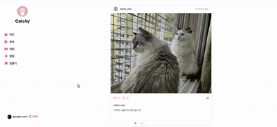
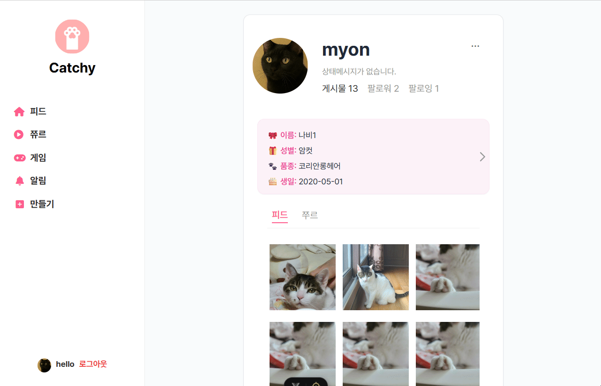
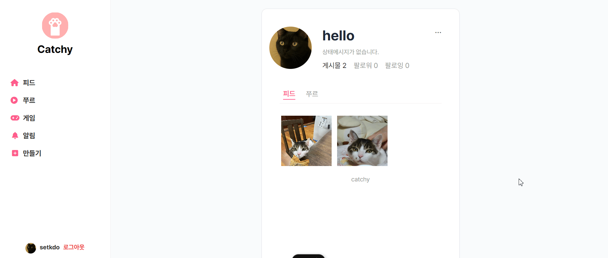
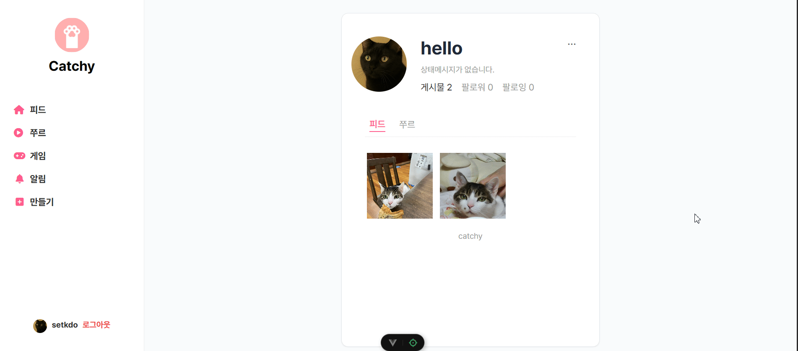
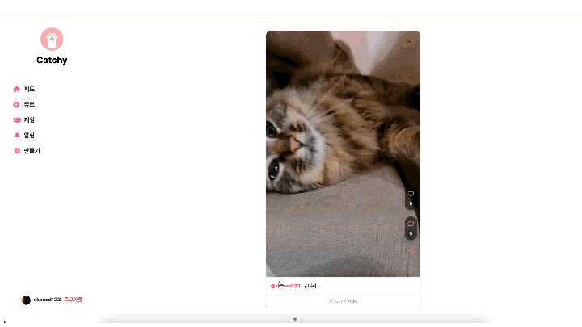
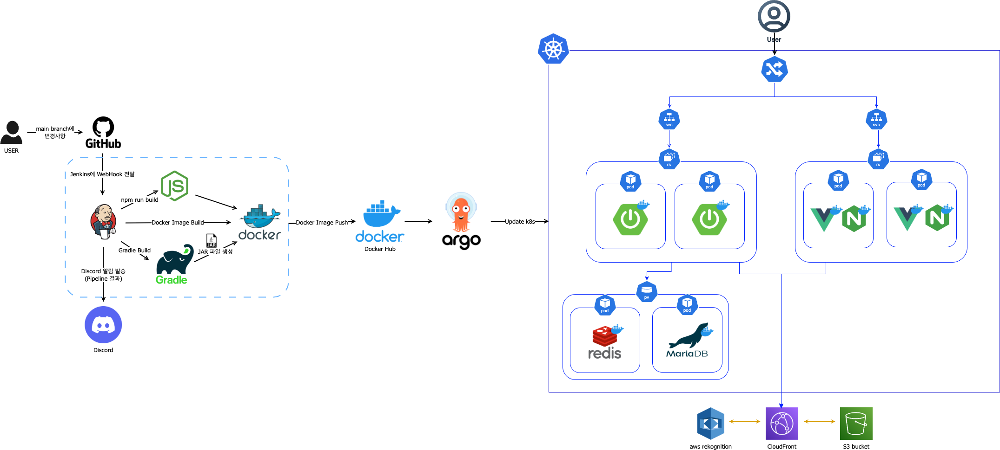
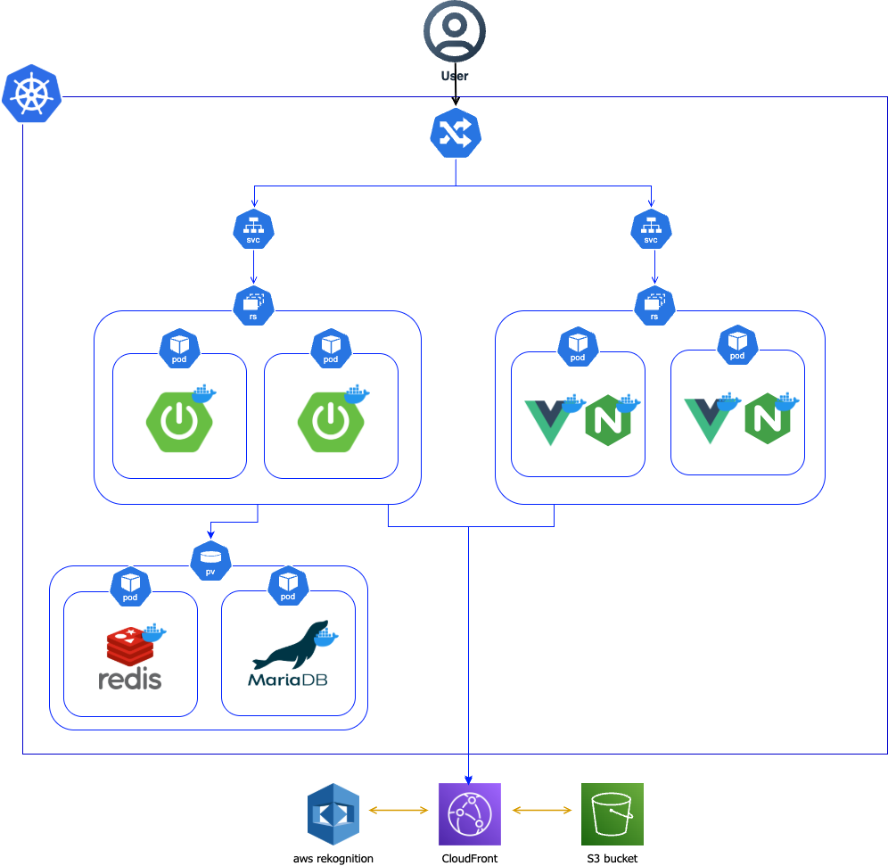
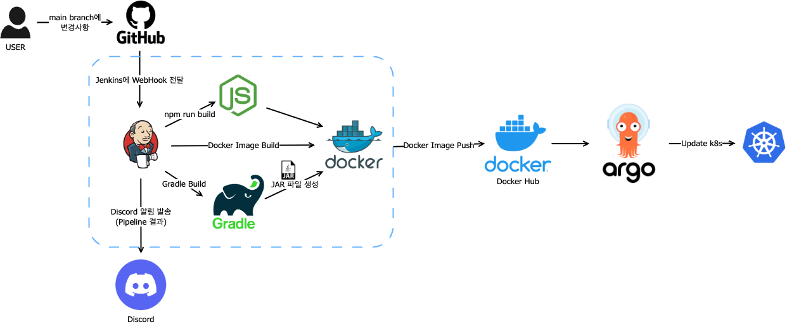

# 🐱 CATCHY

<center>
  
</center>
<div align="center">
  
</div>
<br><br>

## 👨‍💻 DEVELOPERS


<table>
  <tr>
    <td align="center">
      
    </td>
    <td align="center">
      
    </td>
    <td align="center">
      
    </td>
    <td align="center">
      
    </td>
    <td align="center">
      
    </td>
    <td align="center">
      
    </td>
  </tr>
  <tr>
    <td align="center">
      <a href="https://github.com/Kihong12"><b>김기홍</b></a>
    </td>
    <td align="center">
      <a href="https://github.com/kimjy8937"><b>김진영</b></a>
    </td>
    <td align="center">
      <a href="https://github.com/sezeme"><b>김채원</b></a>
    </td>
    <td align="center">
      <a href="https://github.com/develup-psy"><b>박성용</b></a>
    </td>
    <td align="center">
      <a href="https://github.com/ckaudgh"><b>차명호</b></a>
    </td>
    <td align="center">
      <a href="https://github.com/didiha"><b>하채린</b></a>
    </td>
  </tr>
</table>


<br>

## 📜 목차

#### [💡 기술 스택](#-기술-스택)  <br>
#### [📢 프로젝트 소개](#-프로젝트-소개)  <br>
#### [🐾 Catchy FE 테스트 결과 보고서](#-catchy-fe-테스트-결과-보고서)  <br>
#### [🔡 요구사항 명세서](#-요구사항-명세서)  <br>
#### [📟 REST API 명세서](#-rest-api-명세서)  <br>
#### [🗃️ DB 모델링](#-db-모델링)  <br>
#### [📈 플로우 차트](#-플로우-차트)  <br>
#### [🪄 Figma](#-figma)  <br>
#### [🛜 프로젝트 아키텍처](#-프로젝트-아키텍처)  <br>
#### [🚩 젠킨스 파이프라인 파일 스크립트 코드](#-젠킨스-파이프라인-파일-스크립트-코드)  <br>
#### [📱 CI/CD 테스트](#-cicd-테스트)  <br>
#### [🍪 개인 회고록](#-개인-회고록)  <br>

<br>

## 💡 기술 스택

<div align="center">

### 🌿 Backend  


</div>

<div align="center">

### 🌿 Frontend  


</div>

<div align="center">

### 🗃️ Database  


</div>

<div align="center">

### ☁️ Devops  


</div>

<div align="center">

### 🛠️ Tools  


</div>

<br>

## 📢 프로젝트 소개

### 🐾 **Catchy: 고양이를 사랑하는 사람들을 위한 올인원 커뮤니티 플랫폼**

> **Catchy**는 고양이를 사랑하는 사람들을 위한 SNS 기반 커뮤니티 플랫폼입니다.  
> 📸 사진과 🎥 릴스 영상 공유, 👥 팔로우, 💬 댓글, ❤️ 좋아요는 물론,  
> 🕹️ 게임과 🔔 실시간 알림, 🤖 AI 고양이 이미지 판별 기능까지 제공하는 고양이 맞춤형 올인원 웹 서비스입니다.


### 🌟 주요 서비스 기능

✅ **회원 관리**  
- 소셜 로그인/회원가입 (구글, 카카오, 네이버)  
- 프로필 관리 및 수정 (상태메시지, 고양이 정보)  
- 회원 탈퇴, 유저 차단  

✅ **팔로우/언팔로우**  
- 다른 사용자 팔로우 및 팔로잉/팔로워 목록 관리  

✅ **고양이 커뮤니티**  
- 피드(사진) 및 쭈르(영상) 등록, 수정, 삭제  
- 해시태그, 무한스크롤, 공유 기능  
- 댓글 및 대댓글, 좋아요  

✅ **게임**  
- 고양이 카드 맞추기 게임  
- 랭킹, 시간·횟수 제한, 개인 카드 커스터마이징  

✅ **알림**  
- SSE 기반 실시간 알림 (댓글, 좋아요, 팔로우, 생일 알림)  
- 알림 자동 삭제 (30일 후)  

✅ **AI 이미지 검사**  
- 등록 사진이 고양이인지 AI가 판별  
- 비고양이 이미지 등록 시 거부  


### 🚀 Catchy가 만드는 가치

> 단순한 반려묘 사진 공유를 넘어,  
> 집사들끼리 교류하고, 게임으로 즐기며,  
> AI 기술로 고양이 중심 콘텐츠를 관리하는 **혁신적인 고양이 플랫폼**입니다.  
>  
> 🐾 **세상 모든 고양이와 집사를 위한 소셜 놀이터, Catchy에서 당신의 고양이 이야기를 들려주세요!**

<br>

## 🐾 Catchy FE 테스트 결과 보고서

### 📝 회원가입 & 로그인

<details>
  <summary>구글 회원가입</summary>
  <div align="center">
    
  </div>
</details>

<details>
  <summary>네이버 회원가입</summary>
  <div align="center">
    
  </div>
</details>

<details>
  <summary>카카오 회원가입</summary>
  <div align="center">
    
  </div>
</details>

<details>
  <summary>로그인, 로그아웃</summary>
  <div align="center">
    
  </div>
</details>

<details>
  <summary>회원탈퇴</summary>
  <div align="center">
    
  </div>
</details>

### 👤 프로필 기능

<details>
  <summary>본인 프로필 조회</summary>
  <div align="center">
    
  </div>
</details>

<details>
  <summary>본인 프로필 수정</summary>
  <div align="center">
    
  </div>
</details>

<details>
  <summary>타회원 프로필 조회</summary>
  <div align="center">
    
  </div>
</details>

### 📸 피드 기능

<details>
  <summary>피드 등록</summary>
  <div align="center">
    
  </div>
</details>

<details>
  <summary>피드 목록 조회</summary>
  <div align="center">
    
  </div>
</details>

<details>
  <summary>피드 상세조회</summary>
  <div align="center">
    
  </div>
</details>

<details>
  <summary>피드 수정</summary>
  <div align="center">
    
  </div>
</details>

<details>
  <summary>피드 삭제</summary>
  <div align="center">
    
  </div>
</details>

<details>
  <summary>피드 공유</summary>
  <div align="center">
    
  </div>
</details>

<details>
  <summary>피드 좋아요</summary>
  <div align="center">
    
  </div>
</details>

<details>
  <summary>피드 AI 이미지 검열</summary>
  <div align="center">
    
  </div>
</details>

### 🥫 쭈르 기능

<details>
  <summary>쭈르 업로드</summary>
  <div align="center">
    
  </div>
</details>

<details>
  <summary>쭈르 수정</summary>
  <div align="center">
    
  </div>
</details>

<details>
  <summary>쭈르 삭제</summary>
  <div align="center">
    
  </div>
</details>

<details>
  <summary>쭈르 댓글, 좋아요</summary>
  <div align="center">
    
  </div>
</details>

### 💬 댓글 기능

<details>
  <summary>댓글, 답글 달기 및 취소</summary>
  <div align="center">
    
  </div>
</details>

### 🔔 알림 기능

<details>
  <summary>답글 알림 발송</summary>
  <div align="center">
    
  </div>
</details>

<details>
  <summary>댓글 알림 발송</summary>
  <div align="center">
    
  </div>
</details>

<details>
  <summary>팔로우 알림 발송</summary>
  <div align="center">
    
  </div>
</details>

<details>
  <summary>쭈르 좋아요 알림 발송</summary>
  <div align="center">
    
  </div>
</details>

<details>
  <summary>피드 좋아요 알림 발송</summary>
  <div align="center">
    
  </div>
</details>

### 🏆 뱃지

<details>
  <summary>랭킹 1등, 인플루언서, 생일 뱃지</summary>
  <div align="center">
    
  </div>
</details>

### 🤝 팔로우 기능

<details>
  <summary>팔로우 기능</summary>
  <div align="center">
    
  </div>
</details>

### 🛡️ 차단 기능

<details>
  <summary>차단하기</summary>
  <div align="center">
    
  </div>
</details>

<details>
  <summary>차단 시 차단한 사용자의 게시물 보이지 않기</summary>
  <div align="center">
    
  </div>
</details>

<details>
  <summary>차단해제</summary>
  <div align="center">
    
  </div>
</details>

### 🎮 게임

<details>
  <summary>고양이 카드 게임</summary>
  <div align="center">
    
  </div>
</details>

<br>

## 🔡 요구사항 명세서


<br>

## [📟 REST API 명세서](https://docs.google.com/spreadsheets/d/1LiKpL7lfRMg4xijcw1LJebzHuwfKG9ceprzKavaqNMQ/edit?gid=1844885263#gid=1844885263&range=A1:L45)

<br>

## 🗃️ DB 모델링


<br>

## 📈 플로우 차트


<br>

## 🪄 Figma


<table>
  <tr>
    <td align="center" valign="top">
      <br/>
    </td>
    <td align="center" valign="top">
      <br/>
    </td>
    <td align="center" valign="top">
      <br/>
    </td>
  </tr>
</table>

<br>

## 🛜 프로젝트 아키텍처

### 🔨 전체 서비스 아키텍처
<div align="center">
  
</div>


### 🔧 서비스 배포 아키텍처
<div align="center">
  
</div>


### 🚀 CI/CD 파이프라인
<div align="center">
  
</div>

<br>

## 🚩 젠킨스 파이프라인 파일 스크립트 코드

<details>
<summary>코드 보기/접기</summary>

```groovy
pipeline {
    agent any

    tools {
        gradle 'gradle'
        jdk 'openJDK17'
    }

    environment {
        GITHUB_URL = 'https://github.com/be15-six-my-cat/be15-4th-sixmycat-catchy-DEVOPS.git'
        MANIFESTS_GITHUB_URL = 'https://github.com/be15-six-my-cat/be15-4th-k8s-manifestes'
        GIT_USERNAME = 'develup_psy'
        GIT_EMAIL = 'sksssd456@gmail.com'
        PATH = "/usr/local/bin:$PATH"
        DOCKER_USER = 'psy99'
    }

    stages {
        stage('Preparation') {
            steps {
                script {
                    sh '/usr/local/bin/docker --version'
                }
            }
        }

        stage('Clone Repository') {
            steps {
                git branch: 'main', url: "${env.GITHUB_URL}"
                script {
                    env.GIT_COMMIT_SHORT = sh(script: "git rev-parse --short HEAD", returnStdout: true).trim()
                }
            }
        }

        stage('Detect Changes') {
            steps {
                script {
                    env.CHANGED_BACKEND = sh(script: "git diff --name-only HEAD HEAD~1 | grep '^backend/' || true", returnStdout: true).trim()
                    env.CHANGED_FRONTEND = sh(script: "git diff --name-only HEAD HEAD~1 | grep '^frontend/' || true", returnStdout: true).trim()
                }
            }
        }

        stage('Build Backend') {
            when { expression { return env.CHANGED_BACKEND } }
            steps {
                dir('backend') {
                    script {
                        sh 'chmod +x ./gradlew'
                        sh './gradlew clean build -x test'
                    }
                }
            }
        }

        stage('Build Frontend') {
            when { expression { return env.CHANGED_FRONTEND } }
            tools {
                nodejs '24.1.0'
            }
            steps {
                dir('frontend') {
                    sh 'npm install'
                    sh 'npm run build'
                }
            }
        }

        stage('Docker Build and Push') {
            parallel {
                stage('Backend Docker') {
                    when { expression { return env.CHANGED_BACKEND } }
                    steps {
                        dir('backend') {
                            script {
                                def dockerConfigDir = "/tmp/.docker-backend-${env.BUILD_ID}"
                                sh "mkdir -p ${dockerConfigDir}"
                                withCredentials([usernamePassword(
                                    credentialsId: 'DOCKERHUB_PASSWORD',
                                    usernameVariable: 'DOCKER_USER',
                                    passwordVariable: 'DOCKER_PASS'
                                )]) {
                                    sh "echo \$DOCKER_PASS | /usr/local/bin/docker --config ${dockerConfigDir} login --username psy99 --password-stdin"
                                    sh "/usr/local/bin/docker --config ${dockerConfigDir} build -t ${DOCKER_USER}/k8s-boot:${currentBuild.number} -t ${DOCKER_USER}/k8s-boot:${env.GIT_COMMIT_SHORT} -t ${DOCKER_USER}/k8s-boot:latest ."
                                    sh "/usr/local/bin/docker --config ${dockerConfigDir} push ${DOCKER_USER}/k8s-boot:${currentBuild.number}"
                                    sh "/usr/local/bin/docker --config ${dockerConfigDir} push ${DOCKER_USER}/k8s-boot:${env.GIT_COMMIT_SHORT}"
                                    sh "/usr/local/bin/docker --config ${dockerConfigDir} push ${DOCKER_USER}/k8s-boot:latest"
                                }
                            }
                        }
                    }
                }

                stage('Frontend Docker') {
                    when { expression { return env.CHANGED_FRONTEND } }
                    steps {
                        dir('frontend') {
                            script {
                                def dockerConfigDir = "/tmp/.docker-frontend-${env.BUILD_ID}"
                                sh "mkdir -p ${dockerConfigDir}"
                                withCredentials([usernamePassword(
                                    credentialsId: 'DOCKERHUB_PASSWORD',
                                    usernameVariable: 'DOCKER_USER',
                                    passwordVariable: 'DOCKER_PASS'
                                ), string(credentialsId: 'KAKAO_JS_KEY', variable: 'KAKAO_KEY')]) {
                                    writeFile file: '.env.production', text: """
                                        VITE_API_URL=http://localhost/boot/api/v1
                                        VITE_AWS_BUCKET_NAME=be15-4th-catchy-s3-bucket
                                        VITE_AWS_REGION=ap-northeast-2
                                        VITE_KAKAO_JAVASCRIPT_KEY=${KAKAO_KEY}
                                    """
                                    sh "echo \$DOCKER_PASS | /usr/local/bin/docker --config ${dockerConfigDir} login --username psy99 --password-stdin"
                                    sh "/usr/local/bin/docker --config ${dockerConfigDir} build -t ${DOCKER_USER}/k8s-vue:${currentBuild.number} -t ${DOCKER_USER}/k8s-vue:${env.GIT_COMMIT_SHORT} -t ${DOCKER_USER}/k8s-vue:latest ."
                                    sh "/usr/local/bin/docker --config ${dockerConfigDir} push ${DOCKER_USER}/k8s-vue:${currentBuild.number}"
                                    sh "/usr/local/bin/docker --config ${dockerConfigDir} push ${DOCKER_USER}/k8s-vue:${env.GIT_COMMIT_SHORT}"
                                    sh "/usr/local/bin/docker --config ${dockerConfigDir} push ${DOCKER_USER}/k8s-vue:latest"
                                }
                            }
                        }
                    }
                }
            }
        }

        stage('Update K8S Manifests') {
            parallel {
                stage('Backend Manifest') {
                    when { expression { return env.CHANGED_BACKEND || env.BACKEND_IMAGE_BUILT } }
                    steps {
                        dir('manifests') {
                            git branch: 'main', url: "${env.MANIFESTS_GITHUB_URL}", credentialsId: 'github'
                            sh "git config user.name '${env.GIT_USERNAME}'"
                            sh "git config user.email '${env.GIT_EMAIL}'"
                            sh "sed -i '' 's|image: .*k8s-boot:.*|image: ${DOCKER_USER}/k8s-boot:${currentBuild.number}|g' boot-dep.yml"
                            sh "git add boot-dep.yml"
                            sh "git commit -m '[UPDATE] backend image to ${currentBuild.number}'"
                            sh "git push origin main || echo 'Push failed, check branch protection.'"
                        }
                    }
                }

                stage('Frontend Manifest') {
                    when { expression { return env.CHANGED_FRONTEND || env.FRONTEND_IMAGE_BUILT } }
                    steps {
                        dir('manifests') {
                            git branch: 'main', url: "${env.MANIFESTS_GITHUB_URL}", credentialsId: 'github'
                            sh "git config user.name '${env.GIT_USERNAME}'"
                            sh "git config user.email '${env.GIT_EMAIL}'"
                            sh "sed -i '' 's|image: .*k8s-vue:.*|image: ${DOCKER_USER}/k8s-vue:${currentBuild.number}|g' vue-dep.yml"
                            sh "git add vue-dep.yml"
                            sh "git commit -m '[UPDATE] frontend image to ${currentBuild.number}'"
                            sh "git push origin main || echo 'Push failed, check branch protection.'"
                        }
                    }
                }
            }
        }

        stage('ArgoCD Sync') {
            steps {
                script {
                    withCredentials([
                        string(credentialsId: 'ARGOCD_SERVER', variable: 'ARGOCD_SERVER'),
                        string(credentialsId: 'ARGOCD_USERNAME', variable: 'ARGOCD_USERNAME'),
                        string(credentialsId: 'ARGOCD_PASSWORD', variable: 'ARGOCD_PASSWORD')
                    ]) {
                        echo "ArgoCD 로그인 시도 중..."
        
                        def loginStatus = sh(script: """
                            /opt/homebrew/bin/argocd login localhost:8888 \
                                --username ${ARGOCD_USERNAME} \
                                --password ${ARGOCD_PASSWORD} \
                                --insecure
                        """, returnStatus: true)
        
                        if (loginStatus != 0) {
                            error "ArgoCD 로그인 실패! 서버(${ARGOCD_SERVER}), 사용자(${ARGOCD_USERNAME})"
                        }
                        echo "ArgoCD 로그인 성공!"
        
                        if (env.CHANGED_BACKEND) {
                            echo "Backend 앱 동기화 시작..."
                            sh "/opt/homebrew/bin/argocd app sync catchy-backend-app"
                            sh "/opt/homebrew/bin/argocd app wait catchy-backend-app --health"
                            echo "ackend 앱 동기화 완료!"
                        }
        
                        if (env.CHANGED_FRONTEND) {
                            echo "Frontend 앱 동기화 시작..."
                            sh "/opt/homebrew/bin/argocd app sync catchy-frontend-app"
                            sh "/opt/homebrew/bin/argocd app wait catchy-frontend-app --health"
                            echo "rontend 앱 동기화 완료!"
                        }
                    }
                }
            }
        }
    }

    post {
        always {
            script {
                sh "rm -rf /tmp/.docker-* || true"
            }
        }
        success {
            script {
                def changedParts = []
                if (env.CHANGED_BACKEND) changedParts << "백엔드"
                if (env.CHANGED_FRONTEND) changedParts << "프론트엔드"
                def changeInfo = changedParts ? changedParts.join(", ") : "변경 없음"

                withCredentials([string(credentialsId: 'discord', variable: 'DISCORD')]) {
                    discordSend(
                        description: """
                        **✅ 빌드 성공!**

                        **변경 감지:** ${changeInfo}
                        **제목:** ${currentBuild.displayName}
                        **결과:** :white_check_mark: ${currentBuild.currentResult}
                        **실행 시간:** ${currentBuild.duration / 1000}s
                        **링크:** [빌드 결과 보기](${env.BUILD_URL})
                        """.stripIndent(),
                        title: "${env.JOB_NAME} 빌드 성공!",
                        webhookURL: DISCORD
                    )
                }
            }
        }
        failure {
            script {
                def changedParts = []
                if (env.CHANGED_BACKEND) changedParts << "백엔드"
                if (env.CHANGED_FRONTEND) changedParts << "프론트엔드"
                def changeInfo = changedParts ? changedParts.join(", ") : "변경 없음"

                withCredentials([string(credentialsId: 'discord', variable: 'DISCORD')]) {
                    discordSend(
                        description: """
                        **❌ 빌드 실패!**

                        **변경 감지:** ${changeInfo}
                        **제목:** ${currentBuild.displayName}
                        **결과:** :x: ${currentBuild.currentResult}
                        **실행 시간:** ${currentBuild.duration / 1000}s
                        **링크:** [빌드 결과 보기](${env.BUILD_URL})
                        """.stripIndent(),
                        title: "${env.JOB_NAME} 빌드 실패!",
                        webhookURL: DISCORD
                    )
                }
            }
        }
    }
}
```
</details>

<br>

## 🚀 CI/CD 테스트

<details>
  <summary>CI/CD 테스트 보기/숨기기</summary>
  <div align="center">
    
  </div>
</details>

<br>

## 😊 개인 회고록

|  이름  | 회고록                                                                                                                                                                                                                                                                                                                                                                                                                                                                                                                                                                                                   |
| :----: |:-----------------------------------------------------------------------------------------------------------------------------------------------------------------------------------------------------------------------------------------------------------------------------------------------------------------------------------------------------------------------------------------------------------------------------------------------------------------------------------------------------------------------------------------------------------------------------------------------------|
| 김기홍 | 이번 프로젝트에서 프로필 기능 구현을 맡았습니다. 백엔드 개발을 하면서 코드 오류가 많이 발생해 기능을 완성하는 데 예상보다 시간이 오래 걸렸습니다. 이 과정을 통해 아직 코드를 자유롭게 작성하는 데 익숙하지 않다는 점을 깨닫게 되었고, 앞으로 더 많은 연습이 필요하다는 것을 느꼈습니다. 또한 백엔드에서 어떤 데이터가 필요하고, API로 어떻게 데이터를 주고받아야 하는지에 대해서도 많은 배움을 얻었습니다. 특히 코드 오류가 발생했을 때 어디서부터 원인을 추적해야 할지, 어떻게 로그를 보고 문제를 좁혀나갈지 등 디버깅 방법을 배우며, 앞으로 더 꼼꼼하게 코드를 다뤄야겠다는 점을 깨달았습니다. 처음 해보는 일이라도 겁내지 않고 도전해보자는 마음으로 Jira와 GitHub 연동, Spotify API 연결 같은 새로운 시도를 해보았습니다. 특히 웹 페이지에서 음악을 재생하는 기능에 도전했지만, 실제 구현 과정은 예상보다 훨씬 복잡했고 시간도 부족해 결국 완성하지 못한 점은 아쉬움으로 남았습니다. 그럼에도 새로운 기능에 주저하지 않고 도전해본 것 자체에는 큰 만족을 느끼고 있습니다. 이번 경험을 통해 백엔드와 프론트엔드 각각의 세부적인 부분뿐 아니라, 두 서비스를 연결하는 과정에서 예상치 못한 어려움들을 직접 체감할 수 있었습니다. 특히 GitHub 충돌을 해결하고 브랜치를 관리하는 과정을 통해 협업의 중요성과 효과적인 협업 방법에 대해 한층 더 깊이 이해할 수 있었습니다. 앞으로는 이번 경험들을 발판 삼아 더욱 능숙하게 협업하고, 새로운 도전에 임할 때도 더 철저히 준비할 수 있도록 성장해나가고 싶습니다.                                                                                                                                                                                                                                                                                        |
| 김진영 | 이번 프로젝트를 통해 웹 서비스 개발의 전 과정을 경험하며 프론트엔드부터 백엔드, 인프라 구성까지 폭넓은 역량을 키울 수 있었습니다. Vue 3를 활용하여 사용자 친화적인 UI를 구성하였고, Spring Boot 기반의 백엔드에서는 좋아요, 피드 등록 및 수정 등 다양한 기능을 구현하면서 RESTful API 설계와 데이터 흐름에 대한 이해를 깊이 있게 다질 수 있었습니다. 이미지 등록 과정에서 aws s3, cloudfront, rekoginition을 활용해보는 경험을 할 수 있었고, Kubernetes 환경에서의 서비스 구성과 jenkins, argoCD를 사용한 CI/CD 파이프라인으로 배포 자동화를 통해 개발 환경을 효율적으로 관리하는 방법도 익혔습니다. 팀원들과의 원만한 협업을 위해 코드 컨벤션, 깃허브 컨벤션 등 각종 컨벤션을 정하고 진행했고 Jira 통한 프로젝트 관리도 체계적으로 수행하였습니다. 전체적으로 기획부터 개발, 배포까지 서비스 개발 전반을 경험하며 개발자로서의 역량을 한층 끌어올릴 수 있었습니다.                                                                                                                                                                                                                                                                                        |
| 김채원 | 저는 팔로우 기능 프론트엔드, 프로필에서 피드와 쭈르 조회 프론트엔드, 알림 도메인 백엔드와 프론트엔드, 구글 소셜 로그인 기능을 담당했습니다. 특히 SSE를 활용한 실시간 알림 구현과 무한스크롤 기능을 컴포저블 함수로 작성하여 피드, 쭈르, 프로필 피드/쭈르, 팔로잉/팔로워 목록 등 여러 화면에 적용하며 코드의 재사용성과 유지보수성을 높였습니다. 무한스크롤과 SSE의 동작 원리를 실제로 구현하면서 학습할 수 있었고, EventSource에서 헤더 설정이 불가능한 문제는 event-source-polyfill로 해결하는 등 문제 해결 능력도 키울 수 있었습니다. 기능이 일찍 끝나서 다른 파트를 많이 도와줬습니다. 그 과정에서 다른사람이 작성한 코드를 읽는 것에 익숙해질 수 있었습니다.                                                                                                                                                                                                                                                                                       |
| 박성용 | 이번 프로젝트에서 원래 목표는 ELK(Elasticsearch, Logstash, Kibana)로 로그 수집, Grafana + Prometheus로 메트릭 모니터링, Kafka 같은 이벤트 큐 연동, 그리고 클라우드 환경(RDS, S3, CloudFront 등)으로 완전한 상용 배포까지 확장하는 것이었지만 아쉽게도 로컬 자원 부족, 시간 제약, 보안 설정 난이도로 인해 일부 목표는 다음으로 미루게 되었습니다. 그래도 Jenkins와 ArgoCD의 연계, 쿠버네티스의 실제 PVC, ConfigMap, RBAC 설정, 프록시 우회 같은 실전적인 문제 해결 경험은 큰 성장의 발판이 되었다고 생각하고 다음에는 Helm Chart를 활용한 배포, 클라우드 인프라 연동, GitOps 완전 자동화, ELK 및 Kafka 도입까지 확장해 보다 복잡한 DevOps 환경을 만들어보고 싶습니다.                                                                                                                                                                                                                                                                |
| 차명호 | 이번 프로젝트는 제가 맡은 프론트엔드와 백엔드 기능 구현을 중심으로 개발자로서 한층 성장할 수 있는 소중한 경험이었습니다. 프론트엔드에서는 Vue 3와 Pinia, Tailwind CSS를 활용해 사용자 중심의 UI를 구성하고, 필터링/정렬/페이지네이션/댓글 등의 기능을 구현하며 컴포넌트 구조와 상태 관리에 대한 감각을 키울 수 있었습니다. 백엔드에서는 Spring Boot 기반으로 차단 기능과 댓글 기능을 직접 설계하고 구현하면서 JWT 인증 기반의 사용자 인증 처리, REST API 설계, 예외 처리 등 핵심 백엔드 기술 스택에 대한 이해를 깊이 있게 다질 수 있었습니다. 특히 댓글의 계층형 구조 구현과 차단 기능처럼, 사용자 경험을 고려한 세부 기능 개발을 맡으면서 실질적인 문제 해결력을 높일 수 있었던 점이 인상 깊었습니다. 비록 배포나 인프라 구성에는 직접적인 참여가 많지 않았지만, 팀원들이 설정한 CI/CD 파이프라인과 Kubernetes 환경에서의 자동화 구성 등을 지켜보며 간접적으로 DevOps의 흐름을 이해할 수 있었던 것도 큰 배움이었습니다.                                                                                                                                                                                                                                                                                       |
| 하채린 | 저번 프로젝트에 이어 다시 회원 기능에 도전하게 된 이유는 소셜 로그인을 더 깊이 구현해보고 싶었고 액세스 토큰과 리프레시 토큰에 대해 제대로 이해하고 싶었기 때문이다. 이번 프로젝트를 통해 네이버와 카카오의 소셜 로그인 API를 직접 연동해보았고 레디스를 활용한 토큰 관리도 전담하면서 관련 개념을 깊이 있게 익힐 수 있었다. 회원 기능 개발을 믿고 맡겨준 팀원들에게 정말 고맙다. 덕분에 더 큰 책임감을 가지고 개발에 임할 수 있었고 그 과정에서 많은 성장을 느낄 수 있었다. 백엔드 작업뿐만 아니라 프론트 작업도 즐겁게 할 수 있었는데 특히 고양이를 키우는 집사로서 더 애정을 담아 작업했던 부분이 많아 더욱 의미 있게 다가왔다. 조금 아쉬운 점이 있다면 프로젝트 초반에는 실제 배포까지 목표로 삼고 개발을 시작했지만 제시간 내에 그 단계까지 도달하지 못했다는 것이다. 특히 데브옵스 과정에서 개인적인 한계를 많이 느꼈고 앞으로 더 공부가 필요하다는 생각을 하게 되었다. 이번 프로젝트를 통해 즐거운 개발이 재미있는 결과물로 이어진다는 것을 다시 한번 실감할 수 있었다. 다가오는 파이널 프로젝트에서도 팀원들과 함께 재미있고 의미 있는 개발을 이어가고 싶다.                 
